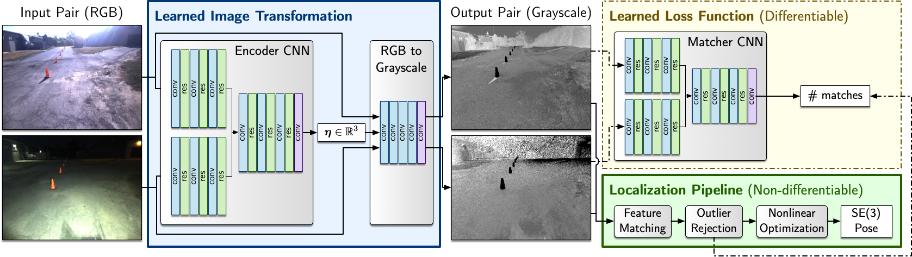

# Matchable Image Transformations for Long-term Visual Localization

Code to accompany our paper "Learning Maximally Matchable Image Transformations for Long-term Visual Localization". 

**NOTE: Input/output data and trained models are not included due to restrictions on file size for supplementary material.**

## Dependencies
* numpy
* matplotlib
* pytorch 1.1 + torchvision 
* Pillow
* progress (for progress bars in train/val/test loops)
* pyviso2 (included)
* tensorboardX

## Contents
* `run_vkitti.py` - Top-level script for training and testing models using the Virtual KITTI dataset.
* `run_inthedark.py` - Top-level script for training and testing models using the UTIAS In The Dark dataset.
* `matchability/` - Main codebase.
  * `datasets/` - Modules for loading and pre-processing the Virtual KITTI and UTIAS In The Dark datasets for use with PyTorch.
  * `experiment.py` - General training, validation and testing loops.
  * `models.py` - Definitions for matcher proxy and image transformation models.
  * `networks.py` - General-purpose neural network classes, specialized in `models.py`.
  * `options.py` - Defines a container class to store configuration parameters and provides common defaults.
  * `transforms.py` - Custom image/tensor transformations.
  * `utils.py` - Miscellaneous utility functions.
* `scripts/` - Scripts for producing figures and videos used in the paper.